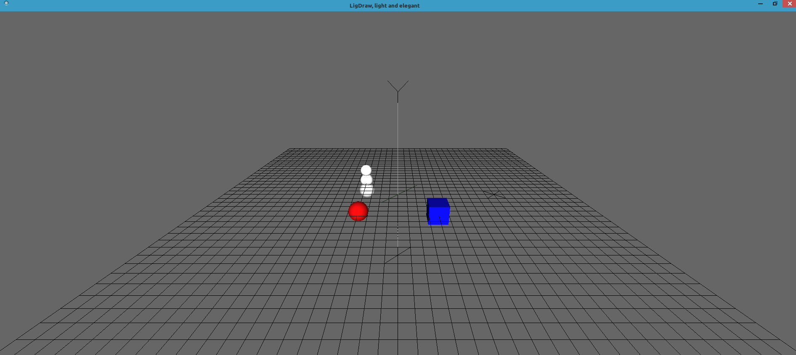
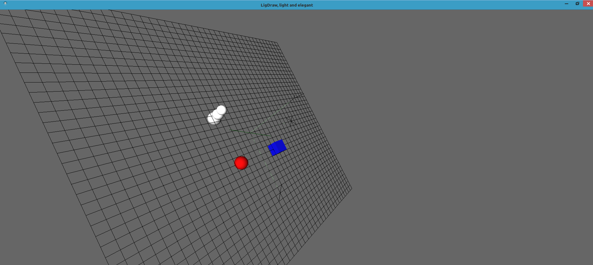
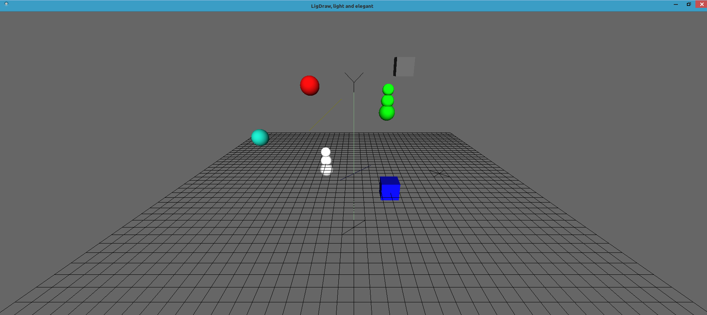
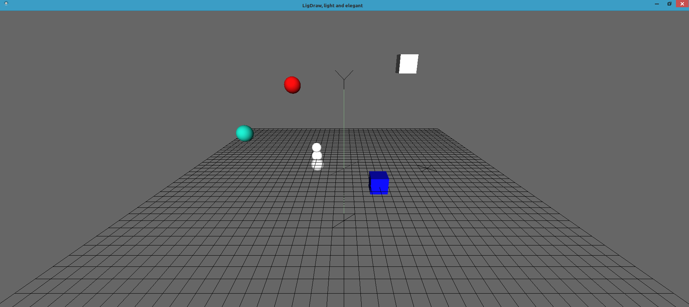
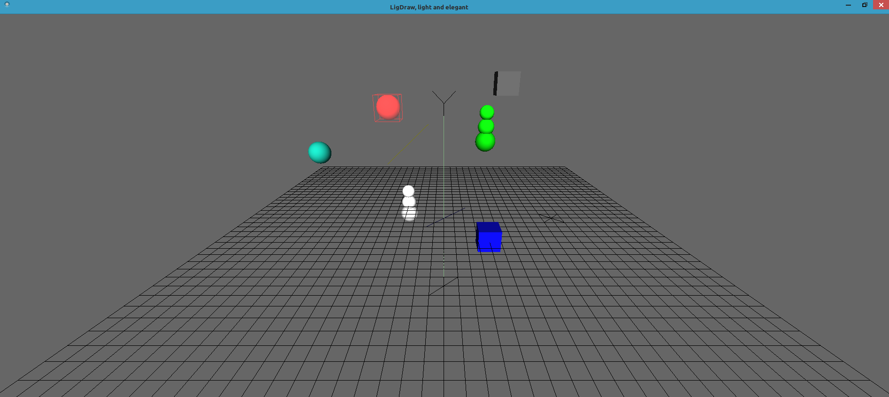
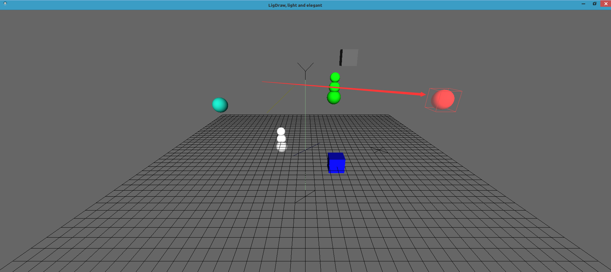
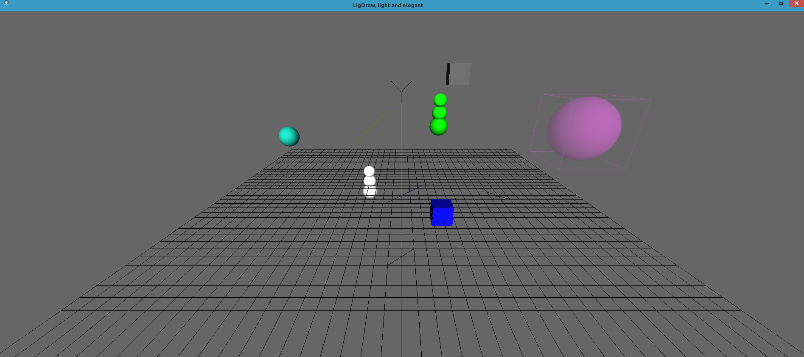
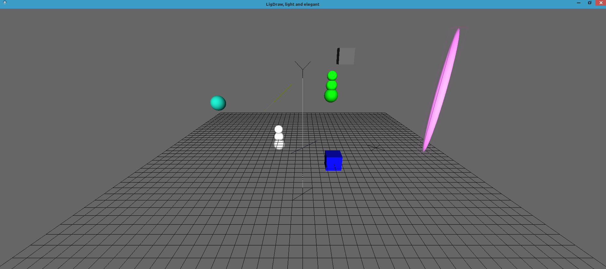
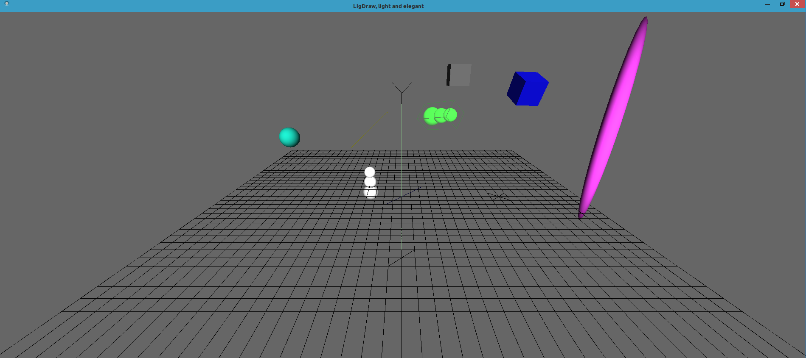

# 报告

[TOC]


## 完成情况
本次项目进展顺利，完成情况良好，覆盖了我们一开始提出的五个预期目标。由于OpenGL属于比较底层的第三方库，开发难度较大，我们克服了线性代数知识的繁杂，以及API的稀少和局限。利用纯粹OpenGL，我们完成了键盘鼠标交互、三维空间里的视角转换、快捷键生成常用模型、三维模型的重合与碰撞检测，以及模型的格式化保存与加载。并且，在设计模式上，我们学习了一些专业的设计模式，借鉴许多优秀项目中的代码框架，使得优化后的代码框架结构清晰、解耦良好，易于未来扩展与多开发者合作。

未来我们考虑在此项目基础上，开发通过网络建模、多人协作的功能(如果暑假有时间)，期望实现如“石墨文档”的多人协作效果。对于这个功能的实现我们目前已有较为明确的思路：设置一个中心服务器用于处理来自多客户端的请求，程序运行于服务器节点，服务器节点内使用多线程(需要使用`thread`库)对多个客户端的请求进行监听，额外设置请求队列将所有到达的操作请求都挂入其中。所有的客户每进行一次操作就将操作发送到服务器，服务器对模型参数进行修改之后广播返回给所有客户端，实现同步更新。客户端与服务器之间使用`Socket`套接字进行通信，我们已具备套接字编程的基本能力，对实现多人协作具有信心。

## 项目效果展示
全局效果

鼠标中键按下拖动可以平移整个坐标轴，鼠标右键按下拖动旋转整个视图

鼠标移动到视图的任意一个地方，键盘`S` `C` `F` `Z`分别可用于产生球体、立方体、球串儿和线段

选中物体，键盘按下`D`可以删除此物体

鼠标左键选中物体的时候，物体会高亮，且显示正方体边框，比如我们选中红色小球

鼠标左键按下可以拖动物体

键盘`↑`和`↓`可以放缩物体大小，`←`和`→`可用于变换物体颜色

键盘`1` `2` `3`用于将物体沿xyz轴进行压缩
键盘`4` `5` `6`用于将物体沿xyz轴进行拉伸

鼠标左线选中物体，接下来按下鼠标右键，可以对物体进行旋转

其次，按下`o`可以保存当前页面为我们定义的一种格式文件，按`L`可用于加载文件中的页面。
### 实现效果
- 创建物体，删除物体
按下`S`、`D`和`Z`时分别在鼠标所指之处将自动产生球体、立方体和线段。
- 选择物体的时候会高光
- 可以对物体进行缩放，拉伸
- 可以物体进行旋转
- 可以对物体进行变色
- 对整个界面进行放大，进行平移，进行旋转 
- 保存场景
- 检测碰撞
- 自带阴影效果
2. 录屏


## 代码组织
TODO:[wyf]不如你把类图放这里？
在代码组织上，本次项目做到了较好的抽象和解耦。在下面的介绍中，我们会详细地讲解项目中的所有主要类，阐述主要类的接口和主要工作。最后我们会给出类与类之间的关系。

解耦的思想遍布整个项目。例如建模工具中的每个物体，它的基类都是Node类。Node类完成的是场景变换工作。Primitive类继承Node类，完成渲染工作。Scene类是场景类，包含了若干Primitive；Scene类的存在，使得程序可以同时维护多个场景，每个场景有自己独立的坐标系和物体，这给分屏带来了可能。Viewer类负责窗口的初始化和键鼠交互。每个类各司其职，又在一定程度上相互交互。

### 关键类解释


#### Viewer类

Viewer类是整个项目的主类，负责各类初始化和整个模型的内容维护工作。
``` python
class Viewer(object):
    def __init__(self):
        self.init_interface()
        self.init_opengl()
        self.init_scene()
        self.init_interaction()
        init_primitives()
    def init_interface(self):
    def init_opengl(self):
    def init_scene(self):
    def init_interaction(self):
    def main_loop(self):
    def render(self):
    def delete(self):
    def init_view(self):
    def get_ray(self, x, y):
    def pick(self, x, y):
    def place(self, shape, x, y):
    def move(self, x, y):
    def rotate_color(self, forward):
    def scale(self, up):
    def scalex(self, up):
    def scaley(self, up):
    def scalez(self, up):
    def load_new_scene(self, file_name='t.save'):
    def save_cur_scene(self, file_name='t.save'):
```
| 函数名称    | 函数功能                 |
| ----------- | ------------------------ |
| \_\_init\_\_    | 初始化窗口、opengl设定，初始化场景（例如场景的网格和坐标轴）、初始化用户交互设置。    |
| init_interface | 利用glut产生窗口并初始化 |
|init_opengl|opengl初始化，例如产生光源和阴影，设置背景色等|
|init_scene|为场景绘制（水平面的）网格和坐标轴。在场景上放置若干个物体,作为初始化。|
|create_samle_scene|在场景上放若干个（默认的）小球|
|init_interaction|用于注册回调函数，处理诸如”添加物体“，”删除物体“，变换视角等|
|main_loop|opengl的阻塞死循环，将控制权完全交给Opengl|
|render  |主要指责是调用scene.render()，渲染出整个场景|
|init_view |摄像机初始化。设置摄像机位置、角度、透视效果等|
|get_ray| 光线追踪函数。当点击屏幕上某个点时，由于三维的图像被变换到二维的电脑屏幕上，鼠标点击的点可以对应三维世界中的一条直线。光线追踪函数用于确定该条直线。|
|pick| 鼠标左键单击可以选中物体。本函数用于确定（和修改）单击后被选中的物体。调用scene.pick()|
|place|按下某些按键后，向模型中放置物体时调用。调用scene.place()|
|move| 移动选中的物体。调用scene.rotate_selected()|
|rotate_color| 变换选中物体的颜色。调用scene.move_selected()|
|scale| 用于缩放选中物体的大小。调用scene.scale_selected()|
|mouse_drag| 鼠标拖拽时的回调函数。变换场景或旋转物体|
|scale*(*是x，y，z)|调用scene.scale*_selected(),用于在某个坐标轴一侧伸缩物体|
|load_new_scene|将当前场景的信息打包成文件|
|svae_cur_scene|将当前场景的信息从文件载入


#### Scene类

在3D建模中，一个及其重要的部分就是3D场景的建造。关于该场景的编写，我们编写了一个可扩展性极强的Scene类。

##### 维护的数据结构

在场景类中,主要维护两个成员

| 成员变量名称  | 作用                                                   |
| ------------- | ------------------------------------------------------ |
| node_list     | 存放存储在该场景中的各个节点。                         |
| selected_node | 为该场景中被选中的节点，若没有被选中的节点，则为None。 |

##### 该类的功能

该类的功能，可以分为以下几个大类，并且每一类都有一些具体的函数。

1. 渲染场景

    | 函数名称 | 函数功能         |
    | -------- | ---------------- |
    | render   | 遍历渲染所有节点 |

2. 对该场景内节点的管理

    | 函数名称    | 函数功能                 |
    | ----------- | ------------------------ |
    | place       | 在场景中增加预置模型     |
    | add_node    | 在场景中增加一个节点     |
    | remove_node | 删除场景中指定的一个节点 |

3. 对“选中节点”功能的支持

    | 函数名称 | 函数功能                                                   |
    | -------- | ---------------------------------------------------------- |
    | pick     | 在鼠标点击后，会调用这个函数，找到对应节点，从而”选中“节点 |

4. 对该场景选中节点的操作

    | 函数名称                                           | 函数功能           |
    | -------------------------------------------------- | ------------------ |
    | move_selected                                      | 移动所选节点       |
    | scalex_selected /scaley_selected / scalez_selected | 对节点进行缩放操作 |
    | rotatex_selected / rotatey_selected                | 对节点进行旋转操作 |
    | rotate_selected_color                              | 改变所选节点的颜色 |


##### 一些说明

注意到viewer中，`Scene`为场景的一个成员对象。Viewer通过调用`Scene`中提供的各个接口，对场景中的节点进行管理与操作。需要特别说明的是，该场景的职责重点在于节点`Node`对象的管理，以及将从`Viewer`类中得到的节点变换信息传达给指定的节点。对于节点本身的操作，并没有做过的干预，仅仅是调用节点`Node`的接口来实现节点的变换。

#### Node类及其派生子类
Node类作为场景中一个个3D对象的基类，定义了在场景中的一个节点必须具有的操作，如平移，旋转，以及最终渲染节点内容的实现。

``` python
class Node(object):
    def __init__(self):
    def drawWireCuboid(self):
    def render(self):
    def render_self(self):
    def translate(self, x, y, z):
    def rotate_color(self, forwards):
    def scale(self, up):
    def scalex(self, up):
    def scaley(self, up):
    def scalez(self, up):
    def rotatex(self, angle):
    def rotatey(self, angle):
    def pick(self, start, direction, mat):
    def select(self, select=None):
```
Node类是场景中所有对象的基类。其私有变量中带存储着所有变换矩阵。包括与平移、旋转、缩放相关的矩阵。该类暴露了修改和设置这些矩阵的API。例如scale函数等。对一个元素的所有变换操作，都可以抽象成调用Node类实现的变换API。在Node类的render_self函数中，会自动把所有的变换矩阵相乘，对类的定点做坐标变换，然后再绘制图像。

| 函数名称                                           | 函数功能           |
| -------------------------------------------------- | ------------------ |
|\_\_init\_\_|类的构造函数，将所有变换矩阵初始化为单位阵|
|render|将所有变换矩阵相乘，得到复合变换，调用render_self做真正的渲染|
| render_self| 该基类中，不实现本函数。会抛出NotImplementedError异常 |
| translate| 平移API，平移到坐标x, y, z处 |
| rotate_color| 改变物体颜色。这是通过修改color_index实现的|
| scale / scalex / scaley / scalez| 等比例地、沿着x轴地、沿着y轴地、沿着z轴地缩放物体|
| rotatex / rotatey | 绕着x轴、绕着y轴旋转|
| pick | 返回鼠标的点击（射出的光线）是否击中（射穿）该物体|
| select| 每次调用时，翻转物体的“被选中”状态|

Node类提供了足够的抽象。更细致的物体类继承于Node类。
下面介绍的Primitive类通过call-list机制，真正实现了Node类中没有实现的render_self操作。
``` python
class Primitive(Node):
    def __init__(self):
        super(Primitive, self).__init__()
        self.call_list = None

    def render_self(self):
        glCallList(self.call_list)
```
首先在一个全局的init函数中，初始化所有的call-list，其中最重要的是基本集合图形的call-list，例如立方体和球体的call-list。在真正的渲染中，我们利用openGL提供的call-list机制，传入一个id，即可完成渲染操作。

例如在下述代码中，将self.call_list初始化为G_OBJ_CUBE.

``` python
class Cube(Primitive):
    """ Cube primitive """
    def __init__(self):
        super(Cube, self).__init__()
        self.call_list = G_OBJ_CUBE
```

为了定义组合图形，我们还定义了类HierarchicalNode,其具体定义见下
``` python
class HierarchicalNode(Node):
    def __init__(self):
        super(HierarchicalNode, self).__init__()
        self.child_nodes = []

    def render_self(self):
        for child in self.child_nodes:
            child.render()
    def rotate_color(self, forwards):
        for child in self.child_nodes:
            child.rotate_color(forwards)
```
self.child_nodes成员函数存储着一个列表。列表的每个元素都是一个Node的派生类。在render_self的实现中，该元素会递归地调用其所有部分的render_self.
#### Interaction
``` python
class Interaction(object)
    def __init__(self):
    def register(self):
    def register_callback(self, name, func):
    def trigger(self, name, *args, **kwargs):
    def translate(self, x, y, z):
    def handle_mouse_button(self, button, mode, x, y):
    def handle_mouse_move(self, x, screen_y):
    def handle_keystroke(self, key, x, screen_y):
```


#### Interaction类『TODO:yf』

#### Node
``` python
class Node(object):
    """ Base class for scene elements """
    def __init__(self):
    def render(self):
    def render_self(self):
    def translate(self, x, y, z):
    def rotate_color(self, forwards):
    def scale(self, up):
    def scalex(self, up):
    def scaley(self, up):
    def scalez(self, up):
    def rotatex(self, angle):
    def rotatey(self, angle):
    def pick(self, start, direction, mat):
    def select(self, select=None):
```
#### Primitive
#### User Define Object

TODO:[yf]

| 函数名称 | 函数作用 |
| -------- | -------- |
|          |          |
|          |          |
|          |          |
|          |          |
|          |          |
|          |          |
|          |          |
|          |          |
|          |          |


### 类间关系解释

TODO:[yf]我水一水。

#### 函数注册机制

`Iteraction`类负责处理与用户交互有关的操作。例如键盘按下，鼠标左键、中键、右键的点击，鼠标的拖动等。由于用户交互无处不在，且用户的操作可能会涉及到整个程序绝大部分状态（例如变量等），如何解耦成为了极其关键的设计问题。

在`Interaction`类中，所有“需要被Interaction类访问“的函数，需要主动向其注册。在注册后，这些函数成为用户操作的回调函数。
``` python
class Interaction(object):
    ...
    def register(self):
        """ register callbacks with glut """
        glutMouseFunc(self.handle_mouse_button)
        glutMotionFunc(self.handle_mouse_move)
        glutKeyboardFunc(self.handle_keystroke)
        glutSpecialFunc(self.handle_keystroke)

    def register_callback(self, name, func):
        """ registers a callback for a certain event """
        self.callbacks[name].append(func)
```
`register`函数向glut注册了常用的回调函数，例如鼠标回调和键盘回调等。

`register_callback`函数供外部代码调用。外部代码在调用时，传递一个函数名（字符串）和函数引用。Interaction类会维护一个字典，将函数名（字符串）映射到函数的引用上。

``` python
...
    def trigger(self, name, *args, **kwargs):
        """ calls a callback, forwards the args """
        for func in self.callbacks[name]:
            func(*args, **kwargs)
```
回调是通过`trigger`函数做到的。trigger函数接收一个函数名，和`*args`, `**kwargs`这两个通用参数。通过在字典中搜索函数名，代码会得到系列函数的列表，对这个列表中的每个函数，传递通用参数。

如此即可做到，在事件发生时，每个注册了的函数都能得到响应，且参数能被正确地传递。
``` python
...
    def init_interaction(self):
        """ init user interaction and callbacks """
        self.interaction = Interaction()
        self.interaction.register_callback('pick', self.pick)
        self.interaction.register_callback('move', self.move)
        self.interaction.register_callback('place', self.place)
        self.interaction.register_callback('rotate_color', self.rotate_color)
        self.interaction.register_callback('scale', self.scale)
        self.interaction.register_callback('delete', self.delete)
        self.interaction.register_callback('scalex', self.scalex)
        self.interaction.register_callback('scaley', self.scaley)
        self.interaction.register_callback('scalez', self.scalez)
        self.interaction.register_callback('save_cur_scene', self.save_cur_scene)
        self.interaction.register_callback('load_new_scene', self.load_new_scene)
        self.interaction.register_callback('mouse_drag', self.mouse_drag)
```
以上是经过注册的函数。其中`move`负责在鼠标左键拖拽时，移动场景。`pick`负责在鼠标点击时，选中物体。`place`负责放置物体。`rotate_color`负责在方向左右键按下时，修改颜色。`scale`负责在方向上下键按下时修改大小。`delete`负责删除物体。`scale*`负责沿着x, y, z三个轴中的一个，伸缩物体。`save_cur_scene`和`load_new_scene`负责保存目前的场景和载入场景。

交互设计的代码极其繁杂，Iteraction需要能访问到绝大多数的变量。在平常（但低效）的实现中，我们可以把所有变量都设置为全局变量，Interaction类通过访问全局变量的方式修改整个程序的状态。但此处的注册、回调机制，允许大部分变量以局部变量的形式存在，只需要变量的作用域处于注册函数中即可。

#### 实例说明『TODO:』

TODO:[yf] 
	1. 函数调用图，适当文字说明
	2. 以修改放大功能，增添功能为例子，结合调用图，说明优越性。

旋转后放大物体，以该例子进行说明整体架构的优越性。


## 项目亮点

TODO:[jp] 水一下就好啦，可以结合上面的一些说明继续不停地吹爆

1. 代码组织就很好，可扩展性优良 
2. 用户交互方式对用户友好
3. 如果还有其他的话就再补充吧


## 项目难点


1. 用OpenGL很难，接触到底层的知识，底层接口不好用 TODO:[jp]
2. 线性代数的需求
在本项目中，需要大量用到线性代数的内容。首先每个物体最初处在模型坐标系中。我们利用矩阵变换的方式，在四维坐标系下，对物体作平移、拉伸、旋转等操作，将其变换到世界坐标系。在这一步中，我们需要注意矩阵相乘的顺序，矩阵的行列顺序。在世界坐标系中，我们需要调整摄像机的角度，增加透视效果等。这些也通过矩阵变换完成。需要对线性代数有一定深度的认识，对四维坐标有一定程度的了解，才能胜任这个代码工作。
3. 基于包围盒的算法实现比较复杂 TODO:[hx]
4. 光线追踪 TODO:[yf]


## 附录一：小组信息

TODO:[yf]
	1. 分工表
	2. 小组名单


## 附录二：用到的库的相关说明


TODO:[jp]

    项目分工
    时间轴？ 
